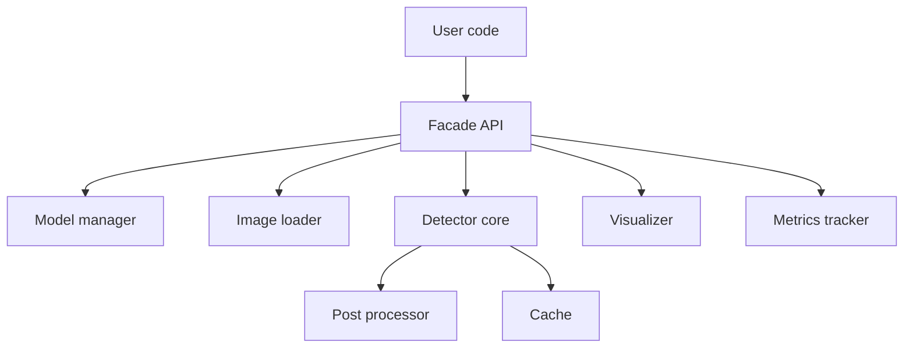
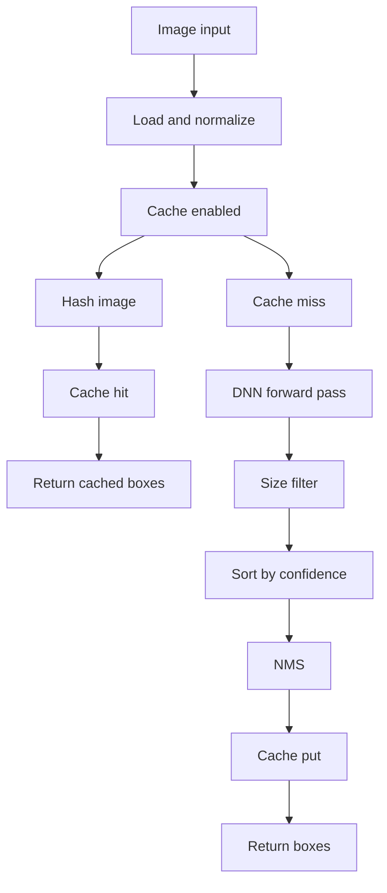

# BlitzID framework internals

This repository contains a modular, DNN-based face detection framework built on OpenCV DNN, with optional CUDA acceleration and optional PIL support.

The code is structured so that new developers can work at the public API level via the facade, while the internal components stay testable and replaceable.

---

## Where to start (onboarding path)

1) Read the public API exports in [`framework/__init__.py`](framework/__init__.py:1)

2) Read the facade (the main entrypoint) in [`framework/facade.py`](framework/facade.py:1)

3) Skim the component implementations:
- model handling: [`framework.models.ModelManager`](framework/models.py:13)
- image ingest + validation: [`framework.image_loader.ImageLoader`](framework/image_loader.py:27)
- detection core: [`framework.detector.FaceDetector`](framework/detector.py:26)
- post-processing: [`framework.processors.FaceProcessor`](framework/processors.py:6)
- caching: [`framework.cache.DetectionCache`](framework/cache.py:11)
- visualization: [`framework.visualizer.FaceVisualizer`](framework/visualizer.py:11)
- metrics: [`framework.metrics.DetectionMetrics`](framework/metrics.py:7) and [`framework.metrics.MetricsTracker`](framework/metrics.py:19)
- error taxonomy: [`framework.exceptions.FaceDetectorError`](framework/exceptions.py:4)

4) Run the demo and smoke tests:
- CLI demo: [`face_detector_demo.py`](face_detector_demo.py:1)
- smoke tests: [`test_refactored.py`](test_refactored.py:1)

---

## High-level architecture

### Component graph

The facade class wires together several small components. This keeps each concern isolated (models, loading, caching, post-processing, viz, metrics).



- Facade API: [`framework.facade.FaceDetectorDNN`](framework/facade.py:42)
- Detector core: [`framework.detector.FaceDetector`](framework/detector.py:26)

### Data flow for a detection call



Key implementation points:
- image load/normalization: [`framework.image_loader.ImageLoader.load()`](framework/image_loader.py:58)
- cache hit path: [`framework.cache.DetectionCache.get()`](framework/cache.py:41)
- cache hash (raw image bytes): [`framework.cache.DetectionCache.compute_hash()`](framework/cache.py:100)
- cache key includes detector config (multi-scale, thresholds): [`framework.detector.FaceDetector._build_cache_key()`](framework/detector.py:106)
- DNN forward pass (single-scale): [`framework.detector.FaceDetector._run_detection()`](framework/detector.py:298)
- optional multi-scale pass (upscale + remap + merge): [`framework.detector.FaceDetector._run_detection_multi_scale()`](framework/detector.py:117)
- post-processing pipeline: [`framework.detector.FaceDetector._postprocess_faces()`](framework/detector.py:289)
- NMS: [`framework.processors.FaceProcessor.apply_nms()`](framework/processors.py:18)

---

## Public API surface (what app code should use)

### Package exports

The package re-exports the intended public types in [`framework/__init__.py`](framework/__init__.py:1), especially:
- [`framework.facade.FaceDetectorDNN`](framework/facade.py:42)
- [`framework.factory.FaceDetectorFactory`](framework/factory.py:13)
- [`framework.metrics.DetectionMetrics`](framework/metrics.py:7)
- [`framework.exceptions.FaceDetectorError`](framework/exceptions.py:4) and its subclasses

The initializer also documents why the facade is implemented outside the package initializer to avoid import cycles: [`framework/__init__.py`](framework/__init__.py:1).

### Facade class

The facade class is the main integration point for applications: [`framework.facade.FaceDetectorDNN`](framework/facade.py:42).

#### Constructor parameters and validation

Constructor: [`framework.facade.FaceDetectorDNN.__init__()`](framework/facade.py:49)

Validation helper: [`framework.facade.FaceDetectorDNN._validate_parameters()`](framework/facade.py:125)

Important knobs:
- `confidence_threshold`: filters out low-confidence detections before they become boxes
- `min_face_size`: filters small boxes during post-processing
- `nms_threshold`: the IoU threshold used by NMS
- caching configuration: `enable_cache` and `max_cache_size`
- preprocessing: `preprocess` enables an *adaptive*, mild luminance preprocessing step in the loader
  (only runs on low-contrast images to avoid harming well-exposed inputs; see [`framework.image_loader.ImageLoader._preprocess()`](framework/image_loader.py:283))
- recall boost: `multi_scale=True` runs detection at multiple upscale factors and merges boxes
  (see [`framework.detector.FaceDetector._run_detection_multi_scale()`](framework/detector.py:117))
- `scales`: tuple of scale factors (must be >= 1.0 and will always include 1.0)

Model directory resolution is deterministic and anchored to the repository root (not the current working directory) via [`framework/facade.py`](framework/facade.py:40).

#### Facade methods (day-to-day usage)

- detect faces:
  - [`framework.facade.FaceDetectorDNN.detect_face()`](framework/facade.py:176)
- detect faces with timing + backend + cache-hit info:
  - [`framework.facade.FaceDetectorDNN.detect_face_with_metrics()`](framework/facade.py:182)
- detect and extract crops:
  - [`framework.facade.FaceDetectorDNN.extract_faces()`](framework/facade.py:192)
- draw boxes and optionally write output:
  - [`framework.facade.FaceDetectorDNN.visualize_detections()`](framework/facade.py:200)
- batch processing of multiple image paths:
  - [`framework.facade.FaceDetectorDNN.detect_faces_batch()`](framework/facade.py:224)
- cache control:
  - [`framework.facade.FaceDetectorDNN.clear_cache()`](framework/facade.py:255)
  - [`framework.facade.FaceDetectorDNN.get_cache_size()`](framework/facade.py:259)

#### Facade factory-style classmethods

These delegate to the separate factory module to avoid import-time cycles:
- [`framework.facade.FaceDetectorDNN.create_fast_detector()`](framework/facade.py:255)
- [`framework.facade.FaceDetectorDNN.create_accurate_detector()`](framework/facade.py:265)
- [`framework.facade.FaceDetectorDNN.create_balanced_detector()`](framework/facade.py:276)

### Presets factory

The presets factory is a convenience layer: [`framework.factory.FaceDetectorFactory`](framework/factory.py:13).

Preset builders:
- speed oriented: [`framework.factory.FaceDetectorFactory.create_fast_detector()`](framework/factory.py:17)
- accuracy oriented: [`framework.factory.FaceDetectorFactory.create_accurate_detector()`](framework/factory.py:45)
- balanced: [`framework.factory.FaceDetectorFactory.create_balanced_detector()`](framework/factory.py:72)
- DeepFace (detection + alignment): [`framework.factory.FaceDetectorFactory.create_deepface_detector()`](framework/factory.py:101)

Design note: the presets primarily tune `confidence_threshold`, `min_face_size`, `nms_threshold`, and caching defaults. The demo script shows how preset defaults can be overridden after construction: [`face_detector_demo.py`](face_detector_demo.py:42).

### Optional DeepFace backend (RetinaFace + alignment)

For batch/offline pipelines where RetinaFace/MTCNN-style alignment quality matters more than throughput, the framework provides an **optional** DeepFace-backed detector.

Implementation: [`framework.deepface_facade.FaceDetectorDeepFace`](framework/deepface_facade.py:1)

Key properties:
- uses `DeepFace.extract_faces(detector_backend="retinaface", align=True)`
- keeps the existing OpenCV DNN detector unchanged: [`framework.facade.FaceDetectorDNN`](framework/facade.py:42)
- stores DeepFace weights under repo-local [`models/`](models/deploy.prototxt:1) by setting `DEEPFACE_HOME` to `models/deepface/`
- DeepFace is optional; missing imports raise [`framework.exceptions.OptionalDependencyError`](framework/exceptions.py:1)

Usage:

```python
from framework import FaceDetectorDeepFace

detector = FaceDetectorDeepFace(detector_backend="retinaface", align=True)
faces = detector.detect_face("images/IMG_3435.jpg")
crops = detector.extract_faces("images/IMG_3435.jpg")  # aligned crops

# If you already saved a cropped face image, wrap DeepFace attribute analysis:
attrs = detector.analyze("path/to/cropped_face.jpg", actions=["age", "gender"])
```

---

## Internal modules (module-by-module)

### Model management

Implementation: [`framework.models.ModelManager`](framework/models.py:13)

Responsibilities:
- ensure model files exist, optionally downloading them
- load the Caffe model into an OpenCV DNN network
- attempt CUDA configuration when available, otherwise fall back to CPU
- optionally **fail fast** when CUDA is required (see `require_cuda` in [`framework.models.ModelManager.load_network()`](framework/models.py:97))

Key functions:
- model file presence and download policy: [`framework.models.ModelManager.ensure_models_exist()`](framework/models.py:54)
- network load and backend configuration: [`framework.models.ModelManager.load_network()`](framework/models.py:97)
- download implementation: [`framework.models.ModelManager._download_models()`](framework/models.py:182)

Model files live in the repository [`models/`](models/deploy.prototxt:1) directory by default and match the OpenCV sample face detector:
- `deploy.prototxt`
- `res10_300x300_ssd_iter_140000.caffemodel`

Integrity note: the framework does **not** perform checksum validation of these model files. If you need reproducibility, pin the model directory contents via your packaging/deployment process.

### Image loading, validation, and optional preprocessing

Implementation: [`framework.image_loader.ImageLoader`](framework/image_loader.py:27)

Responsibilities:
- accept multiple input types: file path, numpy array, optional PIL image
- validate dimensions and dtype
- normalize to a 3-channel BGR image (OpenCV-friendly)
- optionally apply a conservative preprocessing step

Key entrypoint:
- load and normalize: [`framework.image_loader.ImageLoader.load()`](framework/image_loader.py:58)

Validation and normalization helpers live in the same module (private methods near [`framework/image_loader.py`](framework/image_loader.py:111)).

Optional preprocessing (adaptive: contrast check + mild CLAHE on LAB-L + mean-preservation + blending):
[`framework.image_loader.ImageLoader._preprocess()`](framework/image_loader.py:275).

Tuning knobs live on [`framework.image_loader.ImageLoader.__init__()`](framework/image_loader.py:38):
- `clahe_clip_limit` (default lowered for mild behavior)
- `preprocess_min_contrast` (skip preprocessing when contrast is already good)
- `preprocess_blend` (blend factor to keep visual changes subtle)

Error behavior:
- invalid path or unreadable image becomes [`framework.exceptions.ImageLoadError`](framework/exceptions.py:12)
- invalid array shape/dtype or unsupported channels becomes [`framework.exceptions.ImageProcessingError`](framework/exceptions.py:16)

### Core detector

Implementation: [`framework.detector.FaceDetector`](framework/detector.py:26)

Responsibilities:
- orchestrate: load image, cache lookup, forward pass, post-process, cache store
- optionally run multi-scale inference for better recall on small faces
- provide both a simple API and a metrics-returning API
- provide a crop extraction helper

Primary APIs:
- detection without metrics: [`framework.detector.FaceDetector.detect()`](framework/detector.py:156)
- detection with metrics: [`framework.detector.FaceDetector.detect_with_metrics()`](framework/detector.py:199)
- crop extraction: [`framework.detector.FaceDetector.extract_faces()`](framework/detector.py:246)

Forward pass details:
- blob creation uses a fixed 300x300 input size and the standard mean subtraction values for this model: [`framework.detector.FaceDetector._run_detection()`](framework/detector.py:298)
- optional multi-scale detection (upscale + remap): [`framework.detector.FaceDetector._run_detection_multi_scale()`](framework/detector.py:117)

Post-processing stage is explicitly separated: [`framework.detector.FaceDetector._postprocess_faces()`](framework/detector.py:289).

Logging behavior is handled centrally per call: [`framework.detector.FaceDetector._log_results()`](framework/detector.py:347).

### Post-processing utilities

Implementation: [`framework.processors.FaceProcessor`](framework/processors.py:6)

Responsibilities:
- filter out detections below minimum size
- sort by confidence
- apply Non-Maximum Suppression (NMS)

Key methods:
- NMS: [`framework.processors.FaceProcessor.apply_nms()`](framework/processors.py:18)
- size filter: [`framework.processors.FaceProcessor.filter_by_size()`](framework/processors.py:48)
- confidence sort: [`framework.processors.FaceProcessor.sort_by_confidence()`](framework/processors.py:68)
- IoU computation: [`framework.processors.FaceProcessor.calculate_iou()`](framework/processors.py:82)

Design note: the NMS implementation is a simple O(n^2) loop, which is fine for the typical small number of faces but may become a bottleneck if the detector is replaced with one that produces many boxes.

### Caching

Implementation: [`framework.cache.DetectionCache`](framework/cache.py:11)

Responsibilities:
- maintain an in-memory LRU cache (ordered dict)
- compute a content hash for a loaded image
- return defensive copies so callers cannot mutate cached values

Key methods:
- read path: [`framework.cache.DetectionCache.get()`](framework/cache.py:41)
- write path: [`framework.cache.DetectionCache.put()`](framework/cache.py:67)
- hashing: [`framework.cache.DetectionCache.compute_hash()`](framework/cache.py:100)

Important tradeoff: hashing uses `img.tobytes()` in the common case, which can be expensive for large images. The cache is most useful when the DNN forward pass dominates the hashing cost.

### Visualization

Implementation: [`framework.visualizer.FaceVisualizer`](framework/visualizer.py:11)

Responsibilities:
- draw face rectangles and confidence labels
- write images to disk

Key methods:
- draw: [`framework.visualizer.FaceVisualizer.draw_detections()`](framework/visualizer.py:23)
- save: [`framework.visualizer.FaceVisualizer.save_visualization()`](framework/visualizer.py:56)

### Metrics

Data container: [`framework.metrics.DetectionMetrics`](framework/metrics.py:7)

Tracker: [`framework.metrics.MetricsTracker`](framework/metrics.py:19)

The facade records aggregated stats only for calls that go through [`framework.facade.FaceDetectorDNN.detect_face_with_metrics()`](framework/facade.py:180), via [`framework.metrics.MetricsTracker.record_detection()`](framework/metrics.py:29).

Important semantic: on a cache hit, detector processing time is defined as 0.0 in [`framework.detector.FaceDetector.detect_with_metrics()`](framework/detector.py:102) to make cache behavior explicit.

### Exceptions

Exception hierarchy:
- base: [`framework.exceptions.FaceDetectorError`](framework/exceptions.py:4)
- model failures: [`framework.exceptions.ModelDownloadError`](framework/exceptions.py:8)
- image IO failures: [`framework.exceptions.ImageLoadError`](framework/exceptions.py:12)
- image validation/processing failures: [`framework.exceptions.ImageProcessingError`](framework/exceptions.py:16)
- config validation failures: [`framework.exceptions.InvalidParameterError`](framework/exceptions.py:24)

### Exception-handling conventions (what is wrapped vs what bubbles)

The framework aims to make *expected* operational failures easy to handle by standardizing on [`framework.exceptions.FaceDetectorError`](framework/exceptions.py:4) subclasses.

Rules of thumb used across the codebase:
- If an error is part of normal operation (missing image file, download failure, invalid parameter), it should be raised as a [`framework.exceptions.FaceDetectorError`](framework/exceptions.py:4) subclass.
- For batch APIs that continue on individual failures, the batch loop should catch only [`framework.exceptions.FaceDetectorError`](framework/exceptions.py:4) and allow unexpected exceptions to surface (example: [`framework.facade.FaceDetectorDNN.detect_faces_batch()`](framework/facade.py:222)).
- Parameter validation should raise [`framework.exceptions.InvalidParameterError`](framework/exceptions.py:24) rather than generic built-ins (example: [`framework.cache.DetectionCache`](framework/cache.py:11)).
- Image ingestion wraps unexpected load-time problems into [`framework.exceptions.ImageLoadError`](framework/exceptions.py:12) while preserving the original exception as the cause (see [`framework.image_loader.ImageLoader.load()`](framework/image_loader.py:58)).

---

## How to run and verify

### Demo script

Run the CLI demo in [`face_detector_demo.py`](face_detector_demo.py:1).

CUDA verification / fail-fast:
- `--require-cuda` makes the demo exit if the selected backend cannot actually run on GPU.
  - For the OpenCV DNN presets, it wires into `require_cuda` in [`framework.models.ModelManager.load_network()`](framework/models.py:97).
  - For the `deepface` preset, it requires TensorFlow to report at least one visible GPU.
- `--run metrics` prints `backend: CUDA` when the OpenCV DNN detector is using the CUDA backend.

It showcases:
- preset selection via [`framework.factory.FaceDetectorFactory`](framework/factory.py:13)
- visualization output through [`framework.facade.FaceDetectorDNN.visualize_detections()`](framework/facade.py:198)
- face crop extraction through [`framework.facade.FaceDetectorDNN.extract_faces()`](framework/facade.py:190)
- cache behavior and metrics timing semantics

The script writes generated images into [`results/`](results/balanced_cache_on_visualization.jpg).

### Smoke tests

Run the assertions in [`test_refactored.py`](test_refactored.py:1).

This validates:
- deterministic default model directory (repo-root `models/`)
- bbox invariants and type stability
- cache hit semantics in [`framework.detector.FaceDetector.detect_with_metrics()`](framework/detector.py:102)

---

## Gotchas and design decisions

- BGR everywhere: the loader normalizes to BGR to be OpenCV-friendly in [`framework.image_loader.ImageLoader.load()`](framework/image_loader.py:58). If you supply RGB arrays, results may look wrong in visualization or preprocessing.

- PIL is optional: the facade and loader keep PIL as an optional dependency, using type-checking-only imports in
  [`framework/facade.py`](framework/facade.py:14) and conditional imports in [`framework/image_loader.py`](framework/image_loader.py:12).

- Deterministic `models/` resolution: the default model dir is based on `Path(__file__).resolve().parents[1]` in [`framework/facade.py`](framework/facade.py:40) and mirrored in [`framework/factory.py`](framework/factory.py:9). This avoids surprises when the library is imported from another working directory.

- CUDA fallback is best-effort by default: backend selection is attempted in [`framework.models.ModelManager.load_network()`](framework/models.py:97) and falls back to CPU if CUDA is unavailable or misconfigured.
- Fail-fast CUDA: set `require_cuda=True` (or `--require-cuda` in [`face_detector_demo.py`](face_detector_demo.py:1)) to raise [`framework.exceptions.CUDAConfigError`](framework/exceptions.py:20) instead of falling back.
- Environment gotcha: pip wheels like `opencv-python` are commonly CPU-only and can override a system CUDA-enabled OpenCV build. Prefer a venv that can import the system OpenCV (e.g., `include-system-site-packages = true` in [`/.venv/pyvenv.cfg`](.venv/pyvenv.cfg:1)) and keep `opencv-python*` uninstalled.

- Cache hashing cost: the cache hash is based on full image bytes in [`framework.cache.DetectionCache.compute_hash()`](framework/cache.py:100). For large images, hashing can become a non-trivial part of end-to-end latency.

---

## Extension points (how to evolve the framework)

The architecture is intentionally compositional in [`framework.facade.FaceDetectorDNN`](framework/facade.py:42): the facade instantiates the components and passes them into [`framework.detector.FaceDetector`](framework/detector.py:26).

Common ways to extend:
- replace post-processing behavior by changing or extending [`framework.processors.FaceProcessor`](framework/processors.py:6)
- add alternative caching policies by extending [`framework.cache.DetectionCache`](framework/cache.py:11)
- add more preprocessing strategies inside [`framework.image_loader.ImageLoader`](framework/image_loader.py:27)
- add additional presets in [`framework.factory.FaceDetectorFactory`](framework/factory.py:13)

If you introduce new components, keep the same contract: detection returns a list of `(x, y, w, h, confidence)` tuples as used throughout the public API in [`framework.facade.FaceDetectorDNN.detect_face()`](framework/facade.py:176).
