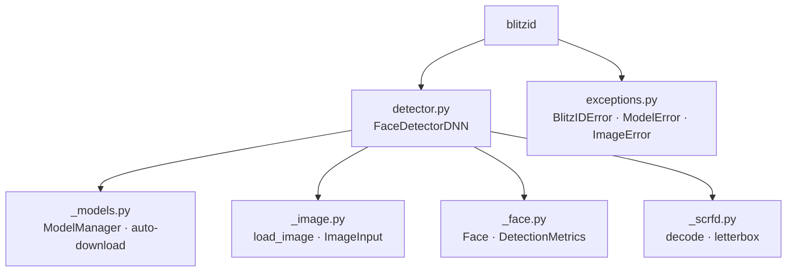

# BlitzID

[](https://github.com/malvavisc0/blitzid/actions/workflows/ci.yml)
[](https://www.python.org/downloads/)
[](LICENSE)

Modular DNN-based face detection framework, optimized for CPU deployment.

## Features

- **SCRFD-2.5G detector** — InsightFace ONNX model with automatic download, run via onnxruntime CPU
- **Landmarks** — 5-point facial landmarks (eyes, nose, mouth corners) via `detect_face_landmarks`
- **LRU result cache** — content-hash based caching to skip redundant inference
- **Multi-scale detection** — configurable scale factors for small-face recall
- **NMS & size filtering** — IoU-based non-maximum suppression + minimum size gate
- **Factory presets** — `create_fast_detector`, `create_accurate_detector`, `create_balanced_detector`
- **Batch processing** — `detect_faces_batch` for directory-level pipelines
- **Visualization** — bounding-box overlay with confidence labels
- **Flexible input** — accepts file paths, NumPy arrays, and PIL Images

## Installation

```bash
pip install blitzid          # or: uv add blitzid
```

## Quick Start

```python
from blitzid import FaceDetectorDNN

detector = FaceDetectorDNN(confidence_threshold=0.5)

# Detect faces → list of (x, y, w, h, confidence)
faces = detector.detect_face("photo.jpg")

# Detect with timing / cache metrics
metrics = detector.detect_face_with_metrics("photo.jpg")
print(metrics.num_faces, metrics.processing_time)

# Use a factory preset
fast = FaceDetectorDNN.create_fast_detector()
```

## API Reference

All public symbols are exported from [`blitzid`](src/blitzid/__init__.py).

### `FaceDetectorDNN`

Defined in [`detector.py`](src/blitzid/detector.py). The primary SCRFD-based detector (CPU inference via onnxruntime).

| Method | Description |
|---|---|
| `detect_face(image_input)` | Returns `list[(x, y, w, h, confidence)]` |
| `detect_face_landmarks(image_input)` | Returns `list[Face]` with 5-point landmarks |
| `detect_face_with_metrics(image_input)` | Returns a `DetectionMetrics` dataclass |
| `extract_faces(image_input, padding=0.2)` | Cropped face arrays with bounding boxes |
| `visualize_detections(image_input, ...)` | Draw boxes on image; optionally save to disk |
| `detect_faces_batch(image_paths)` | Process multiple images |
| `clear_cache()` / `get_cache_size()` | Manage the optional LRU cache |

**Factory presets** (classmethods):

- `create_fast_detector()` — high confidence threshold, caching enabled
- `create_accurate_detector()` — low threshold, small min face size
- `create_balanced_detector()` — middle ground with caching

### `Face`

Frozen dataclass defined in [`_face.py`](src/blitzid/_face.py), returned by `detect_face_landmarks`.

| Field | Type | Description |
|---|---|---|
| `bbox` | `(x, y, w, h)` | Bounding box in image pixels |
| `confidence` | `float` | Detection score in `[0, 1]` |
| `landmarks` | `tuple[(x, y), ...]` | Right eye, left eye, nose tip, right mouth corner, left mouth corner |

### `DetectionMetrics`

Dataclass defined in [`_face.py`](src/blitzid/_face.py).

| Field | Type | Description |
|---|---|---|
| `faces` | `list[Face]` | Detected face records |
| `processing_time` | `float` | Inference time in seconds |
| `image_size` | `(w, h)` | Input image dimensions |
| `backend` | `str` | `"ONNXRuntime"` |
| `num_faces` | `int` | Number of faces detected |
| `cache_hit` | `bool` | Whether the result came from cache |

### Exceptions

Defined in [`exceptions.py`](src/blitzid/exceptions.py).

| Class | Purpose |
|---|---|
| `BlitzIDError` | Base exception for all blitzid errors |
| `ModelError` | Model download or load failure |
| `ImageError` | Image loading, validation, or processing failure |

Backward-compatibility aliases (`FaceDetectorError`, `ModelDownloadError`, `ImageLoadError`, etc.) are re-exported from `__init__.py`.

## Architecture



## Model

`FaceDetectorDNN` runs the **SCRFD-2.5G** face detector (InsightFace
`buffalo_m` detection weights) through an **onnxruntime CPU** session.
The ONNX file is downloaded automatically on first use to a
`platformdirs` cache directory and reused afterwards. There is no
fallback to other models or providers — a missing or unloadable model
raises `ModelError`. Inference input size is configurable via `det_size`
(default `640x640`, multiples of 32); images are letterboxed to preserve
aspect ratio and boxes are mapped back to original image coordinates.

## Development

```bash
# Install all dev + optional deps
pip install -e ".[all]"

# Run tests
pytest

# Lint & type-check
ruff check src/ tests/
mypy src/
```

See [CONTRIBUTING.md](CONTRIBUTING.md) for full guidelines.

## Demo

A CLI demo script is included at [`scripts/face_detector_demo.py`](scripts/face_detector_demo.py):

```bash
# Balanced preset on a single image
python scripts/face_detector_demo.py --preset balanced --run all \
    --image images/bub_der_personalausweis_kopie.jpg
```

## License

[MIT](LICENSE)
