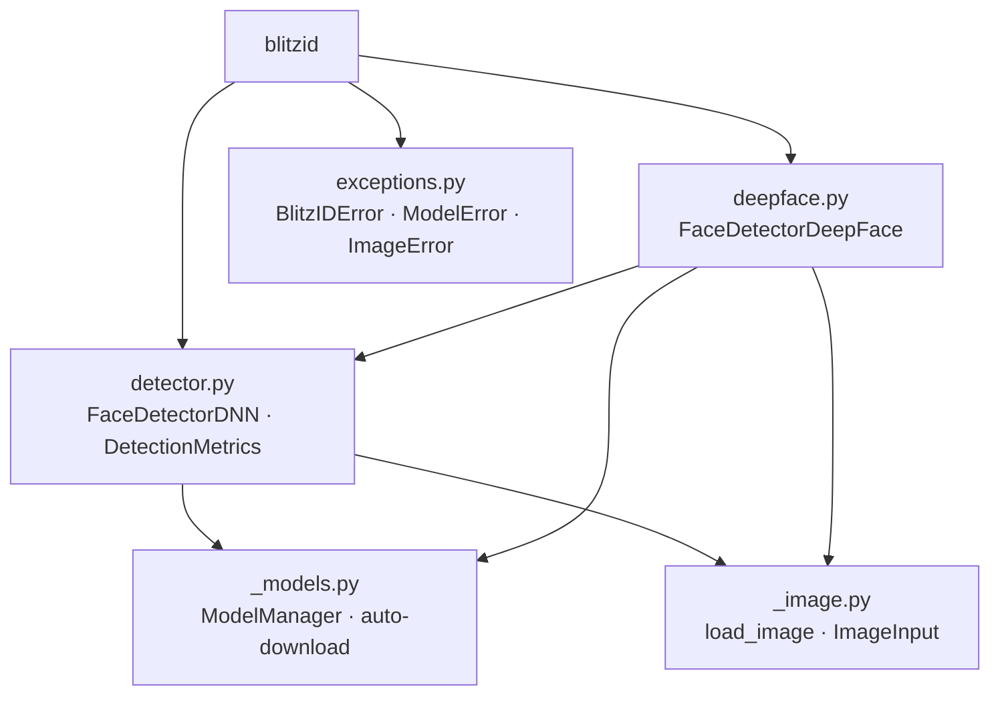

# BlitzID

[](https://github.com/malvavisc0/blitzid/actions/workflows/ci.yml)
[](https://www.python.org/downloads/)
[](LICENSE)

Modular DNN-based face detection framework with optional CUDA acceleration.

## Features

- **OpenCV DNN detector** — SSD ResNet-10 Caffe model with automatic download
- **CUDA acceleration** — transparent GPU offload when OpenCV is built with CUDA
- **Optional DeepFace backend** — RetinaFace / other backends via `FaceDetectorDeepFace`
- **LRU result cache** — content-hash based caching to skip redundant inference
- **Multi-scale detection** — configurable scale factors for small-face recall
- **NMS & size filtering** — IoU-based non-maximum suppression + minimum size gate
- **Factory presets** — `create_fast_detector`, `create_accurate_detector`, `create_balanced_detector`
- **Batch processing** — `detect_faces_batch` for directory-level pipelines
- **Visualization** — bounding-box overlay with confidence labels
- **Flexible input** — accepts file paths, NumPy arrays, and PIL Images

## Installation

```bash
# core (OpenCV DNN detector)
pip install blitzid          # or: uv add blitzid

# with DeepFace backend
pip install blitzid[deepface] # or: uv add blitzid[deepface]
```

## Quick Start

```python
from blitzid import FaceDetectorDNN

detector = FaceDetectorDNN(confidence_threshold=0.5)

# Detect faces → list of (x, y, w, h, confidence)
faces = detector.detect_face("photo.jpg")

# Detect with timing / cache metrics
metrics = detector.detect_face_with_metrics("photo.jpg")
print(metrics.num_faces, metrics.processing_time)

# Use a factory preset
fast = FaceDetectorDNN.create_fast_detector()
```

## API Reference

All public symbols are exported from [`blitzid`](src/blitzid/__init__.py).

### `FaceDetectorDNN`

Defined in [`detector.py`](src/blitzid/detector.py). The primary OpenCV DNN detector.

| Method | Description |
|---|---|
| `detect_face(image_input)` | Returns `list[(x, y, w, h, confidence)]` |
| `detect_face_with_metrics(image_input)` | Returns a `DetectionMetrics` dataclass |
| `extract_faces(image_input, padding=0.2)` | Cropped face arrays with bounding boxes |
| `visualize_detections(image_input, ...)` | Draw boxes on image; optionally save to disk |
| `detect_faces_batch(image_paths)` | Process multiple images |
| `clear_cache()` / `get_cache_size()` | Manage the optional LRU cache |

**Factory presets** (classmethods):

- `create_fast_detector()` — high confidence threshold, caching enabled
- `create_accurate_detector()` — low threshold, small min face size
- `create_balanced_detector()` — middle ground with caching

### `FaceDetectorDeepFace`

Defined in [`deepface.py`](src/blitzid/deepface.py). Optional backend using the [DeepFace](https://github.com/serengil/deepface) library.

Mirrors the `FaceDetectorDNN` API (`detect_face`, `detect_face_with_metrics`, `extract_faces`, `visualize_detections`, `detect_faces_batch`) and adds an `analyze()` method for attribute analysis.

### `DetectionMetrics`

Dataclass defined in [`detector.py`](src/blitzid/detector.py:40).

| Field | Type | Description |
|---|---|---|
| `faces` | `list[tuple]` | Detected face bounding boxes with confidence |
| `processing_time` | `float` | Inference time in seconds |
| `image_size` | `(w, h)` | Input image dimensions |
| `backend` | `str` | `"CUDA"`, `"CPU"`, or `"DeepFace:<backend>"` |
| `num_faces` | `int` | Number of faces detected |
| `cache_hit` | `bool` | Whether the result came from cache |

### Exceptions

Defined in [`exceptions.py`](src/blitzid/exceptions.py).

| Class | Purpose |
|---|---|
| `BlitzIDError` | Base exception for all blitzid errors |
| `ModelError` | Model download, load, or CUDA configuration failure |
| `ImageError` | Image loading, validation, or processing failure |

Backward-compatibility aliases (`FaceDetectorError`, `ModelDownloadError`, `ImageLoadError`, etc.) are re-exported from `__init__.py`.

## Architecture



## CUDA / GPU Acceleration

BlitzID's `FaceDetectorDNN` transparently offloads inference to the GPU when OpenCV is built with CUDA support. Run `python scripts/cuda_diagnostics.py` to check your current setup.

### Prerequisites

1. **NVIDIA GPU driver** — install via your distro's package manager or from [nvidia.com](https://www.nvidia.com/drivers)
2. **CUDA Toolkit** (≥ 11.8) — [developer.nvidia.com/cuda-downloads](https://developer.nvidia.com/cuda-downloads)
3. **cuDNN** (matching your CUDA version) — [developer.nvidia.com/cudnn](https://developer.nvidia.com/cudnn)

### Option A: Build OpenCV from source (recommended)

```bash
# Install build deps (Ubuntu/Debian)
sudo apt install build-essential cmake git pkg-config \
    libgtk-3-dev libavcodec-dev libavformat-dev libswscale-dev

# Clone & build
git clone https://github.com/opencv/opencv.git && cd opencv
mkdir build && cd build
cmake -D CMAKE_BUILD_TYPE=RELEASE \
      -D WITH_CUDA=ON \
      -D CUDA_ARCH_BIN="7.5,8.6,8.9,9.0" \
      -D WITH_CUDNN=ON \
      -D OPENCV_DNN_CUDA=ON \
      -D BUILD_opencv_python3=ON ..
make -j$(nproc) && sudo make install
```

> **Tip:** Adjust `CUDA_ARCH_BIN` to your GPU's compute capability ([lookup table](https://developer.nvidia.com/cuda-gpus)).

### Option B: Pre-built CUDA wheel (experimental)

Community-maintained CUDA-enabled wheels are available but not on the official PyPI:

```bash
# Example (check for your CUDA version)
pip install opencv-contrib-python-cuda
```

### Verification

After installation, re-run the diagnostics to confirm:

```bash
python scripts/cuda_diagnostics.py --rounds 20 \
    --image images/bub_der_personalausweis_kopie.jpg
```

You should see `OpenCV CUDA build: Yes` and a CUDA benchmark section alongside the CPU results.

## Development

```bash
# Install all dev + optional deps
pip install -e ".[all]"

# Run tests
pytest

# Lint & type-check
ruff check src/ tests/
mypy src/
```

See [CONTRIBUTING.md](CONTRIBUTING.md) for full guidelines.

## Demo

A CLI demo script is included at [`scripts/face_detector_demo.py`](scripts/face_detector_demo.py):

```bash
# Balanced preset on a single image
python scripts/face_detector_demo.py --preset balanced --run all \
    --image images/bub_der_personalausweis_kopie.jpg

# DeepFace backend
python scripts/face_detector_demo.py --preset deepface --run basic,extract \
    --image images/bub_der_personalausweis_kopie.jpg
```

### CUDA Diagnostics

[`scripts/cuda_diagnostics.py`](scripts/cuda_diagnostics.py) reports OpenCV CUDA build flags, available GPU devices, and runs a CPU-vs-GPU face detection benchmark:

```bash
# Basic diagnostics
python scripts/cuda_diagnostics.py

# Custom image and benchmark rounds
python scripts/cuda_diagnostics.py --image images/bub_der_personalausweis_kopie.jpg --rounds 20

# Also check TensorFlow GPU visibility
python scripts/cuda_diagnostics.py --check-tensorflow
```

## License

[MIT](LICENSE)
