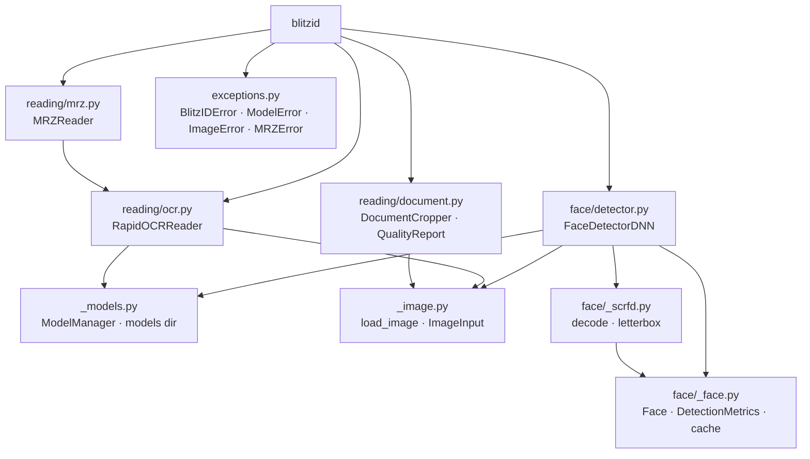

# BlitzID

[](https://github.com/malvavisc0/blitzid/actions/workflows/ci.yml)
[](https://pypi.org/project/blitzid/)
[](https://www.python.org/downloads/)
[](LICENSE)

Read identity documents from images: find faces, read printed text, and
parse the machine-readable zone, in one typed Python library that runs on
an ordinary CPU.

No GPU and no CUDA stack: inference runs on onnxruntime's CPU provider,
face detection takes about 4 ms per image on a laptop, and the weights
(SCRFD-2.5G for faces, PP-OCR for text, ~33 MB total) download on first
use. Faces, ID photos, and document scans are biometric PII, so the
pipeline never sends them anywhere. Everything runs in your process, and
the optional HTTP API keeps uploads and results in RAM only.

## Why blitzid

- **One install, one API.** Face detection, OCR, MRZ parsing, and
  document crop/QC behind a single typed surface, instead of stitching
  a detector, an OCR engine, and your own MRZ code together.
- **Validation over guessing.** Every MRZ field is gated by ICAO 9303
  check digits. A zone that does not validate raises `MRZError` naming
  the failing field, so a wrong-but-plausible document number never
  comes back from a fuzzy "correction".
- **CPU is the target, not a fallback.** The provider is pinned to
  `CPUExecutionProvider`; there is nothing to install for accelerators
  and nothing to fall back from. What runs on your laptop runs the same
  in a container.
- **Ships as a service.** The same analyses come up as an HTTP job
  queue with `docker compose up`, with a synchronous document-QC
  endpoint in front of them.
- **Typed and tested.** `py.typed`, mypy strict, and a pytest suite:
  pure-function tests run without models or network, behavioural tests
  use the committed specimen fixtures.

## Installation

```bash
pip install blitzid           # or: uv add blitzid
pip install blitzid[ocr]      # with OCR text reading (RapidOCR)
pip install blitzid[api]      # with the HTTP API server
```

Note: under plain `pip`, RapidOCR pulls in the GUI `opencv-python`
alongside this package's `opencv-python-headless` (both provide `cv2`).
Prefer `uv`, which overrides the duplicate away. With `pip`,
uninstalling `opencv-python` afterwards keeps a working headless `cv2`.

## Quick start

Detect faces. Output is `(x, y, w, h, confidence)` tuples, or `Face`
records with 5-point landmarks:

```python
from blitzid import FaceDetectorDNN

detector = FaceDetectorDNN(confidence_threshold=0.5)
faces = detector.detect_face("images/nl_td1_id_specimen.jpg")
# [(49, 91, 84, 116, 0.82)]

records = detector.detect_face_landmarks("images/nl_td1_id_specimen.jpg")
# [Face(bbox=(49, 91, 84, 116), confidence=0.82,
#       landmarks=((71, 138), (111, 138), (91, 164), (74, 179), (108, 180)))]
```

Read the machine-readable zone of a document (`blitzid[ocr]`). Every
check digit is validated before you see a field:

```python
from blitzid import MRZReader

record = MRZReader().read("images/nl_td1_id_specimen.jpg")
print(record.mrz_type, record.document_number, record.surname)
# TD1 SPECI2014 DE BRUIJN
```

The face runs in single-digit milliseconds on CPU; the OCR pass behind
the MRZ takes about a second. Full timings under
[Performance](#performance).

## What it does

**Face detection.** SCRFD-2.5G (InsightFace `buffalo_m` ONNX weights)
through onnxruntime CPU: boxes with confidence, 5-point landmarks
(right eye, left eye, nose tip, mouth corners), padded face crops, NMS
and size filtering, an optional multi-scale pass for small faces, a
content-hash LRU cache, batch processing, and bbox visualization.
Presets: `create_fast_detector`, `create_accurate_detector`,
`create_balanced_detector`.

**Text reading.** `RapidOCRReader` (the `ocr` extra) returns text lines
as `OCRText` records: bbox, text, confidence, sorted by confidence.

**MRZ parsing.** `MRZReader` (same extra) selects the ICAO 9303 zone
from OCR output, reassembles the lines by position, validates every
check digit plus the letter-only fields (document code, issuer,
nationality), and parses TD1 (3x30), TD2 (2x36), and TD3 (2x44) into an
`MRZRecord`. Document numbers longer than their field follow the ICAO
convention (overflow at the start of `optional_data1`, no printed check
digit).

**Document crop and QC.** `DocumentCropper` (classical CV, no model)
finds the document quadrilateral, warps it flat at its own aspect, and
quality-checks the crop: document found, aspect ratio near ID-1/ID-3,
resolution, sharpness, brightness, and a side-aware face-presence check
(`front` without a face warns; a `back` side never fails for missing
face). Returns the crop plus a `QualityReport` verdict.

**HTTP API and Docker.** The `api` extra adds a FastAPI service: an
async job queue (Redis, persistence disabled) for face/OCR/MRZ, a
synchronous `/crop` for document QC, and `/health` for orchestration.
`docker compose up` runs it with all weights baked in.

**Inputs.** File paths, NumPy arrays, and PIL Images.

## HTTP API

The `api` extra (`pip install blitzid[api]`) adds an HTTP service over
the library: async jobs for the analyses, a synchronous document-QC
endpoint, and a health check. Docker is the primary deployment: the
image bakes all weights for instant cold start and talks to a RAM-only
Redis.

```bash
docker compose up
curl http://localhost:8000/health
```

**POST /analyze** submits a job (`multipart/form-data`): an `image`
file (any OpenCV-decodable format; PDFs get a precise `415`) and
`types` (repeated and/or comma-separated: `face`, `ocr`, `mrz`).
Validation is eager, before the job exists: `422` unknown type or
missing fields, `400` undecodable bytes or an analysis whose engine is
unavailable (`ocr`/`mrz` without the `ocr` extra), `413` above the
upload cap, `503` + `Retry-After` when the queue is full or Redis is
down. Accepted jobs return `202`:

```bash
curl -F image=@id.jpg -F types=face,ocr localhost:8000/analyze
# {"job_id": "<uuid>", "status": "queued", "status_url": "/jobs/<uuid>"}
```

**GET /jobs/{job_id}** polls: `{"status": "queued"}` / `running`; done
returns `200` with one section per requested type (`face`, `ocr`,
`mrz`; a failing section carries `{"error": ...}` while the others
still return). The read claims the result, so every later read gets
`410 Gone`; unknown ids get `404` (an expired job reads `410` until
twice the TTL past submission, then `404`); results expire after
`BLITZID_API_JOB_TTL_SECONDS` (default 900).

What a done result looks like on the specimen ID (abbreviated):

```json
{
  "status": "done",
  "face": {
    "faces": [
      {
        "bbox": [49, 91, 84, 116],
        "confidence": 0.82,
        "landmarks": [[71, 138], [111, 138], [91, 164], [74, 179], [108, 180]],
        "crop_base64": "/9j/4AAQSkZJRgABAQAAAQAB…"
      }
    ],
    "processing_time_ms": 39.1
  },
  "ocr": {
    "lines": [{"bbox": [20, 359, 70, 17], "text": "Specimen", "confidence": 1.0}, …],
    "processing_time_ms": 1126.9
  },
  "mrz": {
    "record": {
      "mrz_type": "TD1", "document_code": "I<", "issuer": "NLD",
      "document_number": "SPECI2014", "birth_date": "650310", "sex": "F",
      "expiry_date": "240309", "nationality": "NLD",
      "surname": "DE BRUIJN", "given_names": "WILLEKE LISELOTTE",
      "optional_data1": "999999…", "optional_data2": ""
    },
    "processing_time_ms": 1059.4
  }
}
```

**POST /crop** is synchronous document QC (contour detection plus one
SCRFD pass runs in tens of ms): the perspective-corrected canonical
crop plus quality checks (`document_found`, `aspect_ratio`,
`resolution`, `sharpness`, `brightness`, and the side-aware
`face_present`, which never fails a document). Optional `side` field
(`front` / `back` / `unknown`):

```bash
curl -F image=@id.jpg localhost:8000/crop
# {"quad": [...], "crop_base64": "...", "width": 856, "height": 540,
#  "side": "unknown", "face_found": true, "checks": {...},
#  "verdict": "pass"}
```

The crop is the canonical image to keep and to re-submit to `/analyze`
for cleaner OCR/MRZ.

**GET /health** reports engine, Redis, and job availability for
container orchestration. It returns `503` when the job store is
unreachable (the container is unhealthy: it cannot accept or process
jobs); a missing engine stays `200` with its `models` flag false, since
submitting that analysis yields a precise `400`.

Privacy: uploads and results live in RAM end to end. Job payloads are
stored as raw image bytes (never base64-inflated), Redis runs with
persistence disabled, results are claim-once and TTL-bounded, and the
service itself never writes to disk. Worst-case Redis memory is bounded
by the upload cap times the queue and TTL windows. Knobs live in
[`.env.example`](.env.example) (`BLITZID_API_REDIS_URL`,
`BLITZID_API_MAX_UPLOAD_MB`, `BLITZID_API_JOB_TTL_SECONDS`,
`BLITZID_API_MAX_QUEUED_JOBS`, `BLITZID_API_MAX_CONCURRENT_JOBS`,
`BLITZID_API_JOB_LEASE_SECONDS`). Every `v*` tag push publishes
`ghcr.io/malvavisc0/blitzid` (amd64), gated on the full CI gate plus a
compose smoke test; new GHCR packages are private by default, so make
the package public or `docker login ghcr.io` to pull.

## API reference

All public symbols are exported from [`blitzid`](src/blitzid/__init__.py).

### `FaceDetectorDNN`

Defined in [`face/detector.py`](src/blitzid/face/detector.py). The primary SCRFD-based detector (CPU inference via onnxruntime).

| Method | Description |
|---|---|
| `detect_face(image_input)` | Returns `list[(x, y, w, h, confidence)]` |
| `detect_face_landmarks(image_input)` | Returns `list[Face]` with 5-point landmarks |
| `detect_face_with_metrics(image_input)` | Returns a `DetectionMetrics` dataclass |
| `extract_faces(image_input, padding=0.2)` | Cropped face arrays with bounding boxes |
| `visualize_detections(image_input, ...)` | Draw boxes on image; optionally save to disk |
| `detect_faces_batch(image_paths)` | Process multiple images |
| `clear_cache()` / `get_cache_size()` | Manage the optional LRU cache |

**Factory presets** (classmethods):

- `create_fast_detector()` — high confidence threshold, caching enabled
- `create_accurate_detector()` — low threshold, small min face size
- `create_balanced_detector()` — middle ground with caching

### `Face`

Frozen dataclass defined in [`face/_face.py`](src/blitzid/face/_face.py), returned by `detect_face_landmarks`.

| Field | Type | Description |
|---|---|---|
| `bbox` | `(x, y, w, h)` | Bounding box in image pixels |
| `confidence` | `float` | Detection score in `[0, 1]` |
| `landmarks` | `tuple[(x, y), ...]` | Right eye, left eye, nose tip, right mouth corner, left mouth corner |

### `DetectionMetrics`

Dataclass defined in [`face/_face.py`](src/blitzid/face/_face.py).

| Field | Type | Description |
|---|---|---|
| `faces` | `list[Face]` | Detected face records |
| `processing_time` | `float` | Inference time in seconds |
| `image_size` | `(w, h)` | Input image dimensions |
| `backend` | `str` | `"ONNXRuntime"` |
| `num_faces` | `int` | Number of faces detected |
| `cache_hit` | `bool` | Whether the result came from cache |

### `RapidOCRReader`

Defined in [`reading/ocr.py`](src/blitzid/reading/ocr.py); requires the `ocr` extra
(`pip install blitzid[ocr]`). Reads text lines from document images via
RapidOCR (PP-OCR ONNX models on onnxruntime CPU).

| Method | Description |
|---|---|
| `read(image_input)` | Returns `list[OCRText]` sorted by confidence |

**`OCRText`** — frozen dataclass: `bbox` `(x, y, w, h)` in image pixels,
`text` (recognized string), `confidence` in `[0, 1]`.

```python
from blitzid import RapidOCRReader

reader = RapidOCRReader()
for line in reader.read("id_card.jpg"):
    print(line.text, line.confidence)
```

### `MRZReader`

Defined in [`reading/mrz.py`](src/blitzid/reading/mrz.py); requires the `ocr` extra.
Selects MRZ lines from OCR text, validates them via ICAO 9303 check
digits, and parses TD1 (3x30, ID cards), TD2 (2x36), and TD3 (2x44,
passports) zones. No fuzzy OCR-error correction: a zone whose check
digits or letter-only fields fail raises `MRZError`.

| Method | Description |
|---|---|
| `read(image_input)` | Returns an `MRZRecord` |

**`MRZRecord`** — frozen dataclass: `mrz_type`, `document_code`,
`issuer`, `document_number`, `birth_date` (YYMMDD), `sex` (`M`/`F`/`X`),
`expiry_date` (YYMMDD), `nationality`, `surname`, `given_names`,
`optional_data1`, `optional_data2`.

```python
from blitzid import MRZReader

record = MRZReader().read("id_card.jpg")
print(record.mrz_type, record.document_number, record.surname)
```

### `DocumentCropper`

Defined in [`reading/document.py`](src/blitzid/reading/document.py). Pure-CV document localization and QC: finds the largest plausible document quad (Canny edges + contour approximation), warps it into an axis-aligned canonical crop at the quad's own aspect, and quality-checks the crop (thresholds are documented module constants).

| Method | Description |
|---|---|
| `crop(image_input, side="unknown")` | Returns `(crop, QualityReport)`; crop is None when no document was found |

**`QualityReport`** — frozen dataclass: `quad` (corners clockwise from
top-left, or None), `width`, `height`, `side`, `face_found`, `checks`
(each `pass` / `warn` / `fail` / `n/a`), `verdict` (`pass` — no fail,
`warn` — warns only, `reject` — any fail). The optional `detector`
constructor argument (a `FaceDetectorDNN`) enables the side-aware
`face_present` check: `front` without a face warns, `back` is not
expected (TD1 MRZ lives there), without a detector the check is `n/a`.
The optional `detector_lock` argument serializes that check when the
detector instance is shared across threads (the API passes its
per-engine lock).

### Exceptions

Defined in [`exceptions.py`](src/blitzid/exceptions.py).

| Class | Purpose |
|---|---|
| `BlitzIDError` | Base exception for all blitzid errors |
| `ModelError` | Model download or load failure |
| `ImageError` | Image loading, validation, or processing failure |
| `MRZError` | MRZ not found, malformed, or failed check-digit validation |

Backward-compatibility aliases (`FaceDetectorError`, `ModelDownloadError`, `ImageLoadError`, etc.) are re-exported from `__init__.py`.

## Architecture



The optional HTTP API lives in `src/blitzid/api/` (`api` extra) and is
not part of the library import graph above.

## Models

`FaceDetectorDNN` runs the **SCRFD-2.5G** face detector (InsightFace
`buffalo_m` detection weights) through an **onnxruntime CPU** session.
The ONNX file is downloaded automatically on first use and reused
afterwards. There is no fallback to other models or providers: a
missing or unloadable model raises `ModelError`. Inference input size is
configurable via `det_size` (default `640x640`, multiples of 32); images
are letterboxed to preserve aspect ratio and boxes are mapped back to
original image coordinates.

`RapidOCRReader` runs RapidOCR's **PP-OCR** ONNX models (detection,
classification, recognition) through the same onnxruntime CPU profile.

Weights live in the default models dir: `BLITZID_MODELS_DIR` when set,
else `user_cache_dir("blitzid")/models/`. Pre-fetch everything for a
Docker image with `python scripts/download_models.py` (default target:
`models/`); see [models/README.md](models/README.md).

## Performance

Rough single-image timings from [`scripts/benchmark.py`](scripts/benchmark.py)
(11th Gen Intel Core i7-11850H; python 3.13, onnxruntime 1.30, x86_64;
median of 20 warm runs; init is the median of 5 constructions):

| Pipeline | Benchmark | Init (ms) | Median (ms) |
|---|---|---|---|
| fast | `detect_face` (specimen ID card) | 19 | 4 |
| balanced | `detect_face` (specimen ID card) | 18 | 4 |
| accurate | `detect_face` (specimen ID card) | 19 | 24 |
| balanced | `detect_face_with_metrics` (cache hit) | — | 4 |
| RapidOCRReader | `read` (specimen ID card) | 725 | 1024 |
| MRZReader | `read` (specimen ID card) | 1015 | 972 |

The benchmark reports the CPU model automatically, so results files in
`results/` carry the same context. Re-run locally with
`uv run python scripts/benchmark.py --markdown`; the `ocr` benchmarks
are skipped without the `ocr` extra. Numbers vary by machine: treat
them as ballpark figures, not guarantees.

## Demo

A CLI demo script is included at [`scripts/face_detector_demo.py`](scripts/face_detector_demo.py):

```bash
# Balanced preset on a single image
python scripts/face_detector_demo.py --preset balanced --run all \
    --image images/bub_der_personalausweis_kopie.jpg
```

An OCR demo is available at [`scripts/ocr_demo.py`](scripts/ocr_demo.py)
(requires `blitzid[ocr]`):

```bash
python scripts/ocr_demo.py --image images/bub_der_personalausweis_kopie.jpg
```

## Development

```bash
# Install dev dependencies
uv sync --extra dev

# Run tests
uv run pytest tests/ -v

# Lint & type-check (mirrors CI)
uv run ruff check src/ tests/ scripts/
uv run ruff format --check src/ tests/ scripts/
uv run mypy src/ scripts/
```

See [CONTRIBUTING.md](CONTRIBUTING.md) for full guidelines and
[CHANGELOG.md](CHANGELOG.md) for release history.

## Credits

- [InsightFace](https://github.com/deepinsight/insightface) for the
  SCRFD-2.5G detector and the `buffalo_m` detection weights
- [RapidOCR](https://github.com/RapidAI/RapidOCR) for the PP-OCR text
  recognition pipeline
- [ONNX Runtime](https://onnxruntime.ai) for CPU inference
- [ICAO Doc 9303](https://www.icao.int/) for the machine-readable
  travel document specifications behind the MRZ parser

## License

[MIT](LICENSE)
